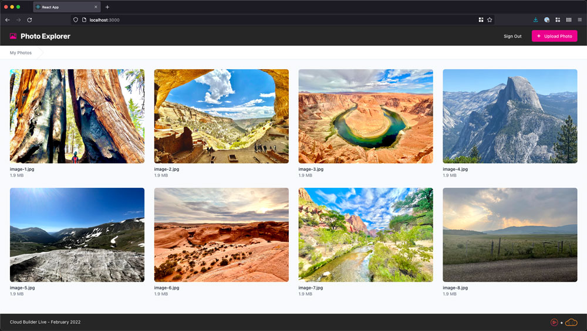

# Cloud Builder Live - Feb 2022

In this episode of Cloud Builder Live, a sample photo application will be deployed into the cloud using AWS Amplify. The overall episode will focus on how to leverage Amplify to handle many core concerns that a normal web application will have.  In addition, there will be a focus on leveraging serverless compute for the processing of images.



## Watch it Live

This episode will air on February 15, 2022 at 6pm Eastern time.  It will be streamed on both [YouTube](https://www.youtube.com/watch?v=dDnSTs2J6fk) and Twitch.  


## What Will Be Added

This will cover several key areas:

| Step | Description |
|-------------|--------------|
| **Hosting** | We will deploy this [React](https://reactjs.org/) application into AWS so that it is hosting via [Amazon S3](https://aws.amazon.com/pm/serv-s3/) and [CloudFront](https://aws.amazon.com/cloudfront/) |
| **Auth** | We will integrate an [Amazon Cognito](https://aws.amazon.com/cognito/) User Pool and Identity Pool to provide secure access to the application and the application's data |
| **Storage** | We will integrate Amazon S3 for secure storage and delivery of the application's photos in a user-specific manner. |
| **Serverless Processing** | We will integrate an [AWS Lambda](https://aws.amazon.com/lambda/) function with Amazon S3 to process each of the photos as they are uploaded.  This will perform several steps including analyzing the images with [AWS Rekognition](https://aws.amazon.com/rekognition/). |

## Prerequisites

To follow along with this episode, you will need to have the following elements in place:

1. **AWS Account** - this will require that you have an AWS account that you can leverage. If you haven't created one, you can [follow the instructions here](https://aws.amazon.com/premiumsupport/knowledge-center/create-and-activate-aws-account/). 
2. **Node.js** - you will need to have Node.js installed.  If you don't have it installed, you can [follow the instructions for it here](https://nodejs.org/en/download/).

## Getting Started

To run the application in its initial state, you can clone the repository and then run the following commands locally:

```bash
npm install
npm run start
```

## Client-Side App

The creation of the React app won't be covered in this episode.  At a high level, this is a React app that leverages, [hooks](https://reactjs.org/docs/hooks-intro.html), [Tailwind CSS](https://tailwindcss.com), and the [React router](https://reactrouter.com/).